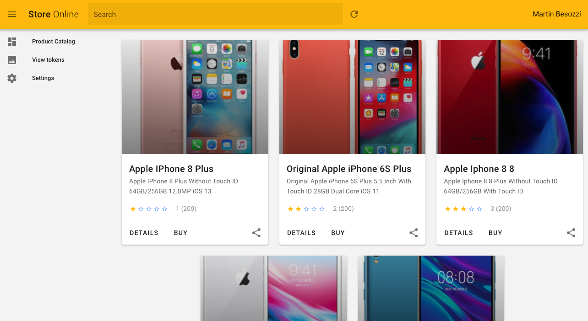

# spa-demoapp-vue
Public SPA demo app vue. The app makes the call to the endpoint ```/api/v1/products``` in order to get products.

# Installation

Clone this repository
```
git clone git@github.com:https://github.com/Identicum/spa-demoapp-vue.git
```

# Configure and run
1. Compile & run:
```
npm run serve
```
You can access to the UI on http://hostname:8080/

# Screenshots


